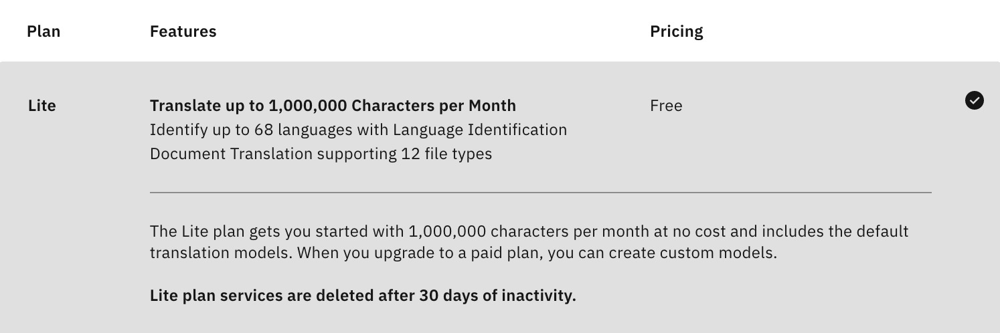

# IMB Cloud Document translator CLI

[](https://github.com/cage1016/document-translator-cli/actions/workflows/release.yml)

## Usage

Visti [releases](https://github.com/cage1016/document-translator-cli/releases) to download latest version

```
$ ./document-translator-cli
Using config file: /Users/kaichuchung/.document-translator-cli.yaml
Translate Document via IBM Cloud Language Translator

Usage:
  document-translator-cli [flags]
  document-translator-cli [command]

Available Commands:
  completion  Generate the autocompletion script for the specified shell
  delete      Delete translated document.
  download    Download translated document.
  help        Help about any command
  list        Lists documents that have been submitted for translation.
  translate   Submit a document for translation.

Flags:
      --api_key string   IBM Cloud Language Translator API KEY (default "API KEY")
      --config string    config file (default is $HOME/.document-translator-cli.yaml)
  -h, --help             help for document-translator-cli
  -t, --toggle           Help message for toggle
      --url string       IBM Cloud Language Translator API URL (default "URL")
      --version string   IBM Cloud Language Translator API VERSION (default "VERSION")

Use "document-translator-cli [command] --help" for more information about a command.
```

1. Prepare `$HOME/.document-translator-cli.yaml`. Vist [Language Translator - IBM Cloud](https://cloud.ibm.com/catalog/services/language-translator) request `apiKey` & `url`

    

    ```bash
    API_KEY=<replace-your-api-key>
    URL=<replace-url>
    cat <<EOF >> $HOME/.document-translator-cli.yaml
    api_key: ${API_KEY}
    url: ${URL}
    version: 2018-05-01
    EOF
    ```

2. Translate a file

    `.doc`, `.docx`, `.ppt`, `.pptx`, `.xls`, `.xlsx`, `.rtf`, `.odt`, `.odp`, `.ods`, `.pdf`, `.htm`, `.html`, `.xml`, `.json`, `.txt`

    [](https://asciinema.org/a/471109)

3. Download the translated file

    [](https://asciinema.org/a/471108)

4. Delete the translated file

    [](https://asciinema.org/a/471107)

## Contribute
If you find any bug or want to propose a new feature, please open an issue to discuss it.

## License
This repository contains free software released under the MIT Licence. Please check out the [LICENSE](./LICENSE) file for details.    